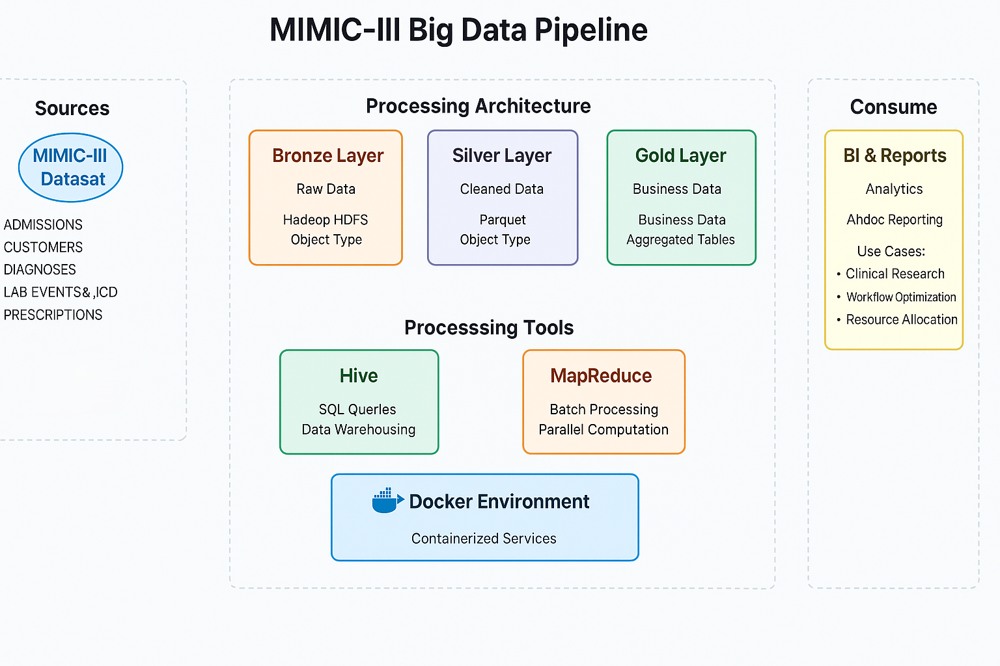

🏥 MIMIC-III Big Data Pipeline for Healthcare Analytics
This project implements a scalable Big Data pipeline to process and analyze the MIMIC-III clinical dataset. Leveraging technologies like Hadoop, Hive, Spark, and Docker, the pipeline facilitates efficient extraction, transformation, and loading (ETL) of large-scale healthcare data, enabling insightful analytics on patient information.

## MIMIC-III Big Data Pipeline

The diagram below illustrates the architecture of the big data pipeline built for the MIMIC-III dataset:




🎯 Objectives:

Establish a robust ETL pipeline for the MIMIC-III dataset.

Utilize distributed storage and processing frameworks for handling large datasets.

Perform analytical queries to derive meaningful healthcare insights.

Ensure reproducibility and scalability through containerized environments.

🛠️ Technologies Used:

Docker & Docker Compose: Containerization and orchestration of services.

Hadoop (HDFS): Distributed storage system for large datasets.

Hive: Data warehouse infrastructure for querying and managing large datasets.

Java MapReduce: Programming model for processing large data sets.

Python: Data preprocessing and transformation.

📁 Project Structure
```
.
├── data/                      # Raw and processed data files
├── hive/                      # Hive scripts and queries
├── mapreduce/                 # Java MapReduce jobs
│   ├── src/
│   ├── build.sh
│   └── patients.csv
├── docs/                      # Project documentation
│   └── documentation.docx
└── README.md                  # Project overview and instructions
```
🗃️ Dataset: MIMIC-III
Source: https://physionet.org/content/mimiciii-demo/1.4/

Description: MIMIC-III is a large, publicly available database comprising de-identified health-related data associated with over forty thousand patients who stayed in critical care units of the Beth Israel Deaconess Medical Center between 2001 and 2012.

⚙️ Setup Instructions:

1- Clone the Repository
```
git clone https://github.com/Marcel-Jan/docker-hadoop-spark
```
2- Launch the Docker Environment
```
docker-compose up -d
```
3- Converting Data to Big Data Formats

Storing large datasets as raw CSV files is inefficient for distributed systems due to their size and lack of schema enforcement. Converting the extracted and cleaned MIMIC-III data into columnar, compressed formats like Parquet or Avro drastically improves storage efficiency and query performance

4- Load Data into HDFS
```
docker exec -it namenode bash
hdfs dfs -mkdir -p /user/hadoop/mimic/patients
hdfs dfs -put /path/to/patients.csv /user/hadoop/mimic/patients
```
5- Hive Table Creation

example :
```
CREATE EXTERNAL TABLE patients (
  subject_id BIGINT,
  gender STRING,
  dob TIMESTAMP
)
STORED AS PARQUET
LOCATION '/user/hadoop/mimic/patients';
```
6- Apply Analytical Queries

Average Length of Stay by Diagnosis:
```
  SELECT diagnosis, AVG(los_days_int) AS avg_los
  FROM admissions
  GROUP BY diagnosis;
```
🧱 Data Model Overview
```
PATIENTS
├── subject_id (PK)
├── gender
└── dob

ADMISSIONS
├── hadm_id (PK)
├── subject_id (FK → PATIENTS.subject_id)
├── admission_type
└── diagnosis

ICUSTAYS
├── icustay_id (PK)
├── hadm_id (FK → ADMISSIONS.hadm_id)
└── icu_intime

DIAGNOSES_ICD
├── hadm_id (FK → ADMISSIONS.hadm_id)
└── icd_code
```

7-Java MapReduce Job (Average Age Calculation)
```
cd mapreduce/
  chmod +x build.sh
  ./build.sh
Execute the Job:

  docker cp AvgAge.jar hadoop-namenode:/root/
  docker cp patients.csv hadoop-namenode:/root/
  docker exec -it hadoop-namenode bash
  hdfs dfs -mkdir -p /user/hadoop/input
  hdfs dfs -put /root/patients.csv /user/hadoop/input/
  hadoop jar /root/AvgAge.jar AvgAge /user/hadoop/input /user/hadoop/output_avg_age
  hdfs dfs -cat /user/hadoop/output_avg_age/part-r-00000
```
-------projectworkflow---------
```
+-----------------------------+
|  MIMIC-III Clinical Dataset |
|     (CSV Files / Demo)     |
+-------------+--------------+
              |
              v
+-----------------------------+
|    Data Preprocessing       |
|  (Python / Spark Scripts)   |
|  - Cleaning                 |
|  - Convert to Parquet       |
+-------------+--------------+
              |
              v
+-----------------------------+
|     Hadoop HDFS Storage     |
+-------------+--------------+
              |
        +-----+------+-------------------------+
        |                            |         |
        v                            v         v
+---------------+      +------------------+   +------------------+
| Hive External |      | Java MapReduce   |   | Spark (Optional) |
| Tables        |      | (e.g. Avg Age)   |   | Streaming Engine |
+-------+-------+      +--------+---------+   +--------+---------+
        |                        |                      |
        v                        v                      v
+--------------------------------------------------------------+
|                  Query Results & Analytics                   |
|     (e.g. Avg LOS, ICU readmissions, Mortality rates)        |
+--------------------------------------------------------------+
```

📄 Documentation
Detailed documentation, including data dictionaries, processing steps, and architectural diagrams, is available in the docs/ directory:
 MIMIC-III Big Data Pipeline documentation.docx

